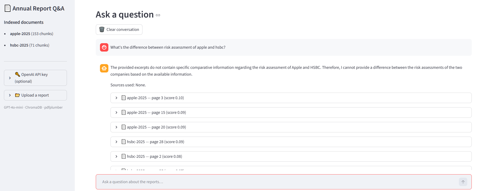

# Annual Report Q&A

A RAG (Retrieval-Augmented Generation) app that lets you ask natural-language questions about company annual reports and get answers with page-level citations.

Pre-loaded with Apple and HSBC annual reports. Upload your own PDFs to query any report.

**[▶ Live Demo](https://annual-report-rag-l8aogwvfxwzneatnebkguj.streamlit.app/)**



---

## How It Works

```
PDF upload
  ↓
Parse page by page (pdfplumber)
  ↓
Embed each page → store in ChromaDB (text-embedding-3-small)
  ↓
User asks a question
  ↓
Embed query → retrieve top-5 most similar pages (cosine similarity)
  ↓
GPT-4o-mini answers using retrieved pages as context
  ↓
Answer shown with page citations
```

The key difference from a naive chatbot: the LLM only answers from the retrieved document passages — it cannot hallucinate facts from outside the uploaded reports. If the answer isn't in the documents, it says so.

---

## Features

- **Pre-loaded reports** — Apple and HSBC annual reports indexed on startup; demo works immediately
- **Upload any PDF** — add your own annual reports via the sidebar; max 10 MB with the shared key, unlimited with your own key
- **Bring your own API key** — paste your OpenAI key in the sidebar to use the app without restrictions and avoid shared key limits
- **Streaming responses** — answers stream token by token as the LLM generates them, so results appear immediately rather than waiting for the full response
- **Query rewriting** — before retrieval, GPT-4o-mini rewrites the question to expand financial synonyms (e.g. "net income" → "net income profit for the year net profit earnings") and resolve follow-up references using chat history; the rewritten query is shown under the answer for transparency
- **Chat history** — follow-up questions work naturally; the last 3 exchanges are included in each prompt so the LLM understands context like "What about the year before?"
- **Table-aware extraction** — financial tables (income statements, balance sheets) are extracted as structured row-by-row text in addition to page text, improving accuracy on numerical questions
- **Page-level citations with relevance scores** — every answer shows which document and page each fact came from, along with the cosine similarity score of the retrieved chunk
- **Smart multi-document retrieval** — regular questions search across all docs; comparison questions (e.g. "How do Apple and HSBC differ?") automatically retrieve from each document independently to guarantee balanced representation
- **Section-aware chunking with overlap** — pages are the natural unit for annual reports; very long pages are split in half; the last 200 characters of each page's plain text are prepended to the next page's chunk so sentences and numbers that span a page boundary are not lost
- **No hallucination** — LLM is instructed to answer only from context; unknown facts are acknowledged
- **Persistent index** — ChromaDB vector store persists to disk; already-indexed documents are not re-embedded on re-run
- **Remove uploaded reports** — user-uploaded documents can be removed from the index without affecting bundled reports

---

## Tech Stack

| Layer | Library |
|---|---|
| PDF parsing | pdfplumber |
| Embeddings | OpenAI text-embedding-3-small |
| Vector store | ChromaDB (local, persistent) |
| LLM | GPT-4o-mini |
| UI | Streamlit |

---

## Project Structure

```
annual-report-rag/
├── app.py                  # Streamlit UI
├── rag/
│   ├── ingest.py           # PDF parsing, chunking, embedding, ChromaDB storage
│   ├── retriever.py        # Query ChromaDB, return top-k chunks with metadata
│   └── answerer.py         # Build prompt, call GPT-4o-mini, return answer + citations
├── data/
│   └── reports/            # Pre-loaded PDFs (Apple 2025, HSBC 2025)
├── chroma_db/              # Vector store — pre-built snapshot committed for bundled reports
├── .env.example
├── requirements.txt
└── README.md
```

---

## Getting Started

### 1. Clone
```bash
git clone https://github.com/Xiiiaowen/annual-report-rag.git
cd annual-report-rag
```

### 2. Install
```bash
pip install -r requirements.txt
```

### 3. Set API key
```bash
cp .env.example .env
# Edit .env and add your OpenAI key
```

You need:
- `OPENAI_API_KEY` — from [platform.openai.com](https://platform.openai.com)

### 4. Run
```bash
streamlit run app.py
```

The bundled reports are indexed automatically on first run. This calls the embeddings API once (~$0.01 total) and caches results to disk for all future runs.

---

## What This Demonstrates

- **RAG pipeline built from scratch** — no LangChain or LlamaIndex; every step (chunking, embedding, retrieval, prompting) is written explicitly, making the logic transparent and explainable
- **Grounded answers with citations** — answers are traceable to specific pages; the LLM cannot fabricate facts outside the provided context
- **Conversation memory** — rolling chat history passed to the LLM enables natural follow-up questions without repeating context
- **Smart retrieval routing** — the app detects comparison queries and switches retrieval strategy automatically, guaranteeing balanced evidence from each document
- **Section-aware chunking** — pages are used as the natural document boundary rather than arbitrary character counts, producing more coherent chunks and cleaner citations
- **Cost-aware design** — `text-embedding-3-small` is used for embeddings (cheap, good quality); documents are only embedded once and cached to disk

---

## What Could Be Improved in Practice

**Hybrid search (vector + keyword)**
Pure cosine similarity can miss chunks that contain the exact keyword being searched, if the embedding similarity is slightly lower than other chunks. Production RAG systems combine vector search with BM25 keyword search (hybrid retrieval) to improve recall on exact-match queries.

**Cold-start on Streamlit Cloud**
A pre-built ChromaDB snapshot for the bundled reports is committed to the repo, so bundled reports do not need to be re-embedded on each cold start. User-uploaded documents are ephemeral and must be re-uploaded after the app sleeps.

---

## Disclaimer

For learning and demonstration purposes. Not intended for production use without additional hardening.
